# College Management System

Welcome to the College Management System (CMS) repository. This document outlines the requirements, features, and functionalities of the CMS. This system is designed to streamline administrative, faculty, and student activities within a college.

## Introduction

The College Management System (CMS) is developed to facilitate and manage various activities in a college setting. This document serves as a comprehensive guide to the features and functionalities of the CMS. It ensures that all involved parties, including developers, testers, and users, have a clear understanding of the system's capabilities.

The CMS is divided into three main modules:

- **Administration**
- **Faculty**
- **Student**

Each module has distinct features designed to simplify and optimize specific tasks.

## Presentation

For a detailed overview of the project, check out [documentation](assets/adbmsPROJECT.pdf).

## Modules

### Administration

The Administration module is designed for college administrators to manage key aspects of the college. It includes the following features:

- **Login:** Secure authentication for administrators.
- **Add/Delete Faculty:** Manage faculty members by adding or removing their profiles.
- **Add/Delete Student:** Manage student enrollment by adding or removing student profiles.
- **Add/Delete Department:** Organize academic departments.
- **Add/Delete Subject:** Maintain the list of subjects offered by the college.
- **Logout:** Securely end the administrator session.

### Faculty

The Faculty module allows instructors to manage academic information related to their courses and students. It includes the following features:

- **Login:** Secure authentication for faculty members.
- **Add/Edit Marks of Student:** Enter and update student marks.
- **Upload/Delete Notes:** Share course notes and resources with students.
- **Logout:** Securely end the faculty session.

### Student

The Student module provides students with access to their academic records and resources. It includes the following features:

- **Login:** Secure authentication for students.
- **View Marks Details:** Check personal academic performance.
- **View Uploaded Notes:** Access course materials uploaded by faculty.
- **Logout:** Securely end the student session.

## System Requirements

To run the College Management System, ensure your environment meets the following requirements:

- **Operating System:** Windows, macOS, or Linux
- **Web Server:** Apache
- **Database:** MySQL
- **Backend:** Node.js
- **Frontend:** HTML, CSS, JavaScript

## Usage

Once installed, you can access the College Management System through your web browser. Use the login credentials provided to access the respective modules:

- **Administrator:** Manage faculty, students, departments, and subjects.
- **Faculty:** Enter student marks and upload course notes.
- **Student:** View marks and access course materials.

## Screenshots

### Login Page
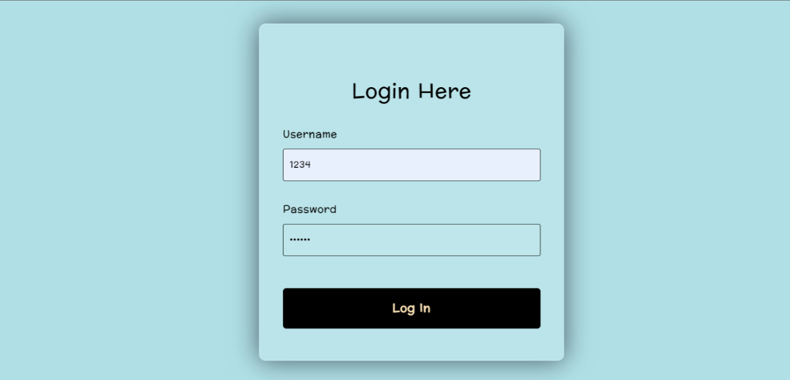

### Admin Home Page
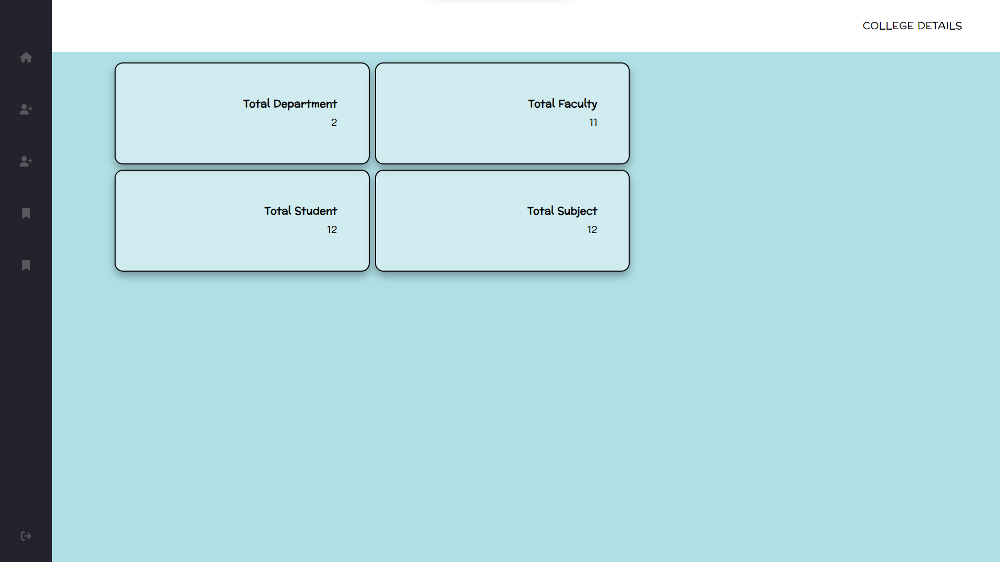

### Faculty List Page
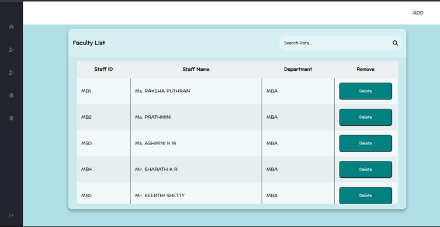

### Add Faculty Page
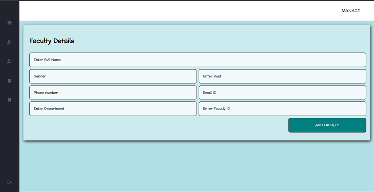

### Student List Page

### Add Student Page
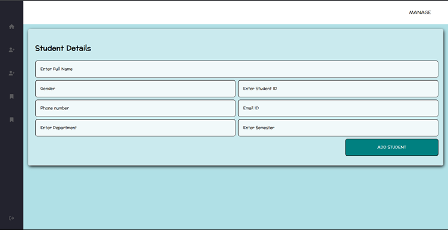

### Department List Page
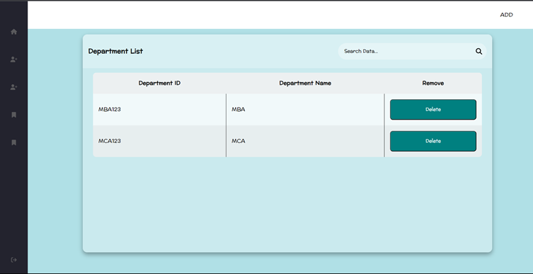

### Add Department Page
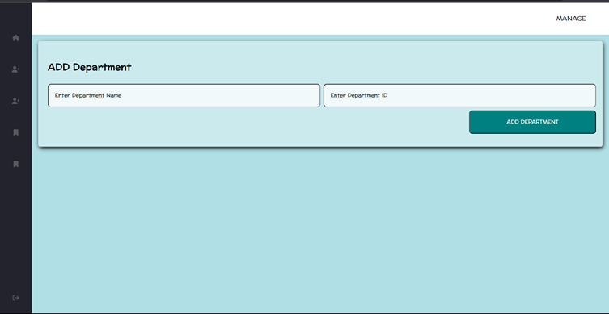

### Subject List Page 
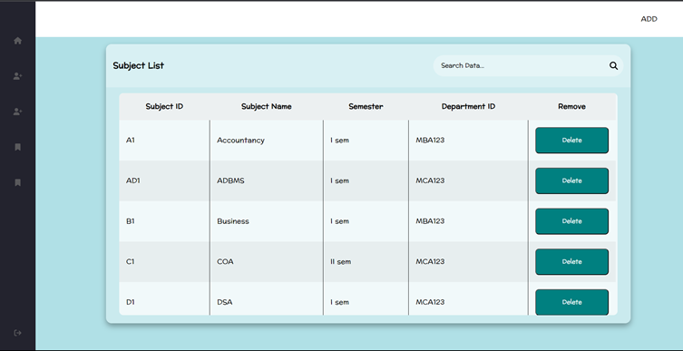

### Add Subject Page
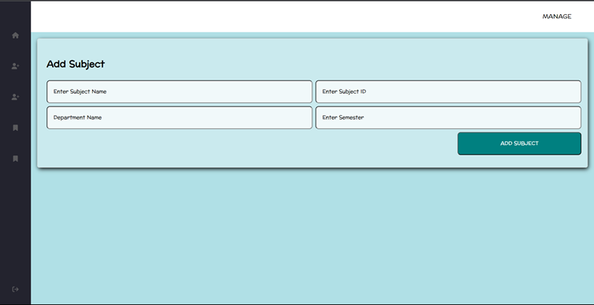

### Add Marks Page
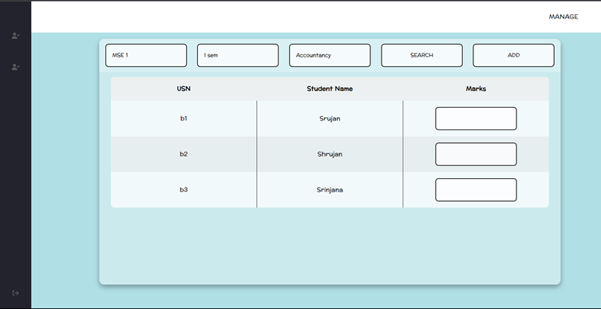

### Edit Marks Page
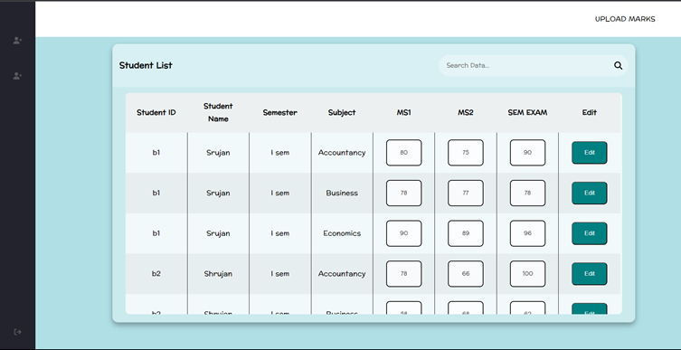

### Add / Delete Notes Page
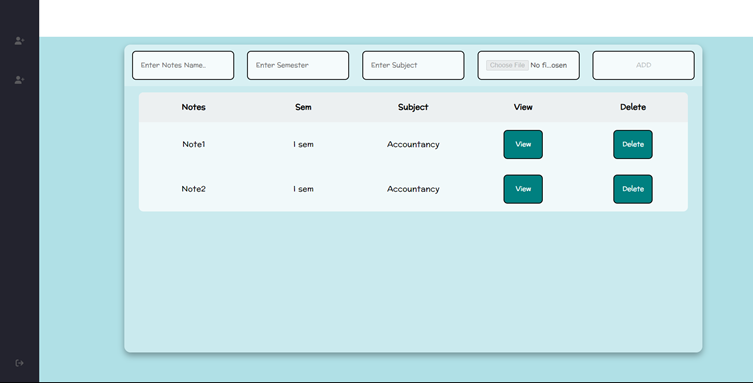

## Contact

For any inquiries, please contact:
- **Name**: [Satvik R Shetty](mailto:satvikrshetty423@gmail.com)
- **LinkedIn**: [Satvik R Shetty](https://www.linkedin.com/in/satvik-r-shetty/)
- **GitHub**: [satvik423](https://github.com/satvik423)

---

Thank you for using the College Management System! We hope it enhances the efficiency and experience of managing academic activities at your institution.
